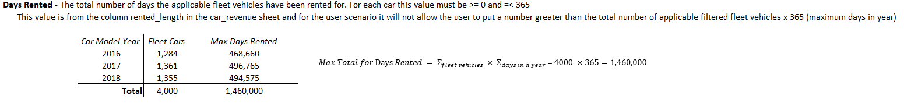
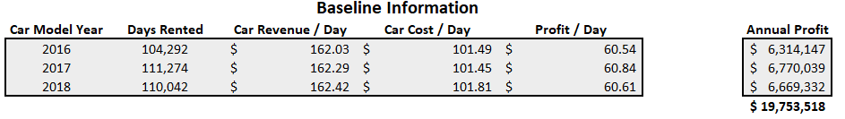
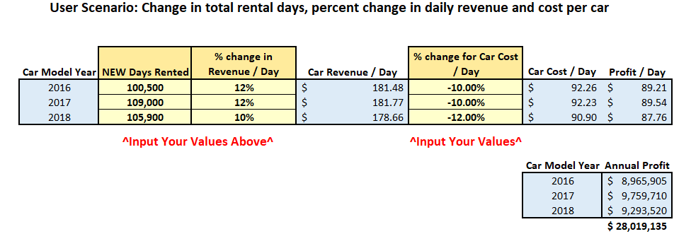

[](https://github.com/bradfordjohnson/lariat-rentals/blob/main/README.md)

## Project Summary 🗒️
### `🧭- Project scenario`
```
- I was consulting as a data analyst for Lariat.
- They hired me to make suggestions on how they can make smarter business decisions.
- My job was to analyze the costs and revenue generated by their rental car fleet. 
```
| **Lariat's Business Objective** |
|---|
| minimizing costs and maximizing revenue |

### `📂- Deliverables`
```
Click the icons or text below to see my project files and deliverables
```
| [PowerPoint](https://1drv.ms/p/s!Ahpkb3AfX4xfhLwtwCAS3g6L6ZA6sQ?e=3JhUY6) | [Excel](https://1drv.ms/x/s!Ahpkb3AfX4xfhLw5nv0BCOoHdWSS5g?e=knZCre) |
|:---:|:---:|
| [](https://1drv.ms/p/s!Ahpkb3AfX4xfhLwtwCAS3g6L6ZA6sQ?e=3JhUY6) | [](https://1drv.ms/x/s!Ahpkb3AfX4xfhLw5nv0BCOoHdWSS5g?e=knZCre) |

### `🔧- Methods`
```
- Data cleaning and exploration
- Defining parameters
- Group vehicles by model year for baseline
- Break down "the numbers" to the daily level (ex. Revenue per day, cost per day...)
- Create a user scenario that can take custom values and apply them to the baseline
```




### `🔍- Findings`
```
- Newer cars from model years 2017 and 2018 are rented slightly more than 2016 models
- The baseline costs and revenues across the 3 different car model years are very similar
- The top 4 most popular car makes, determined by having the most days rented, are Ford, Chevrolet, Dodge, and Toyota respectively


```
### `💡- Recommendations`
