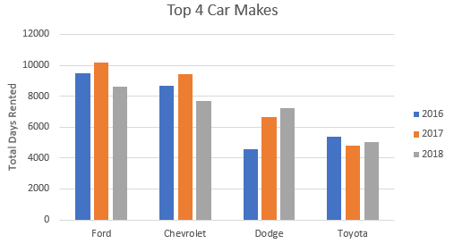
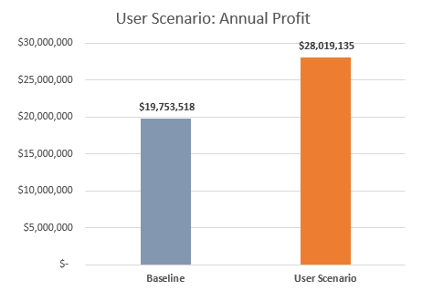

[](https://github.com/bradfordjohnson/lariat-rentals/blob/main/README.md)

## Project Summary 🗒️
### `🧭- Project scenario`
```
- I was consulting as a data analyst for Lariat
- They hired me to make suggestions on how they can make smarter business decisions
- My job was to analyze the costs and revenue generated by their rental car fleet
  - They provided me the data for their nationwide 4,000 car fleet
```
| **Lariat's Business Objective** |
|---|
| minimizing costs and maximizing revenue |

### `📂- Deliverables`
```
Click the icons or text below to see my project files and deliverables
```
| [PowerPoint](https://1drv.ms/p/s!Ahpkb3AfX4xfhLwtwCAS3g6L6ZA6sQ?e=3JhUY6) | [Excel](https://1drv.ms/x/s!Ahpkb3AfX4xfhLw5nv0BCOoHdWSS5g?e=knZCre) |
|:---:|:---:|
| [](https://1drv.ms/p/s!Ahpkb3AfX4xfhLwtwCAS3g6L6ZA6sQ?e=3JhUY6) | [](https://1drv.ms/x/s!Ahpkb3AfX4xfhLw5nv0BCOoHdWSS5g?e=knZCre) |

### `🔧- Methods`
```
- Data cleaning and exploration
- Defining parameters
- Group vehicles by model year for baseline
- Break down "the numbers" to the daily level (ex. Revenue per day, cost per day...)
- Create a user scenario that can take custom values and apply them to the baseline
```


### `🔍- Findings`
```
- The top 4 most popular car makes: Ford, Chevrolet, Dodge, and Toyota 
  - These 4 car makes account for over ¼ of the rental fleet
- The daily revenue and cost per car does not vary much by model year
- Total rental days is not significantly different among the 3 different car model years
```





### `💡- Recommendations`
```
- Minimizing Costs
    - Retire and sell high-cost, low return vehicles
    - Replace with more popular and higher revenue make/models
- Maximizing Revenue
    - Increase the prices for rentals
    - When doing this assume a decrease in total days rented
```
